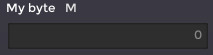
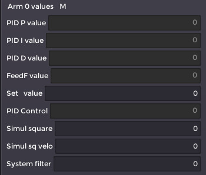
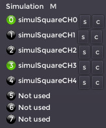

# User Configuration File (UCF)

UCF is in fact a Lua file. It is for sure not necessary to know the Lua language to create or manipulate the file, but respecting the Lua syntax is mandatory. Also, it is a good idea to have an editor with Lua syntax coloration, it helps to see any mistake, especially a missing bracket.

There are three main objects in the file:

1) The **Default** object:

    ```Lua
    cfg:Default({
        --parameters
    })
    ```

    This object appears only once at the beginning of the file. Inside are the parameters for the communication and the gui layouting.

2) The **Variable** object:

    ```Lua
    cfg:Variable({
        --parameters
    })
    ```

    This object is used for representing one variable -or several variables in an array- that is reported by the target. The file can have many objects of this kind.

3) The **Solid** object:

    ```Lua
    cfg:Solid({
        --parameters
    })
    ```

    This object is used for representing a 3D shape in the 3D view. The file can have many objects of this kind.

## Syntax

Each of the three objects has this special syntax:

```Lua
cfg:XXX({
    --parameters
})
```

Don't worry about this, that means only that Lua calls the embedded function XXX with parameters given between `{ }` (a table in Lua).

All the parameters follow the simple syntax:

`Key = Value,` (may have spaces around the `=`)

(notice to comma at the end of the line, this one is optional if the parameter is the last one)

Depending of the Key, the Value can be a string, a boolean (`true` or `false`), a Lua function (see further), a Lua table (again something surrounded by `{ }`) or a simple numerical value.

The file can have comments, all characters following `--` are ignored.

## The **Default** object

This object is described here after with all its possible Keys, explanations are inside:

```Lua
cfg:Default({
    ----------------------
    -- Mandatory fields --
    ----------------------    
    Baudrate = 460800, -- Must match the baudrate used by the target

    -- Commands from monitor to target;
    SetValue = '#', -- Don't modify this
    ReportValueOn = '?', -- Don't modify this
    ReportValueOff = '!', -- Don't modify this

    -- Messages from target to monitor
    IReportValue =        ':', -- Don't modify this
    IReportTextConsole =  '>', -- Don't modify this

    --Every sampleTimeHW a variable is sent
    SampleTimeHW= 0.001, -- Must match the one of the target for correct timing display

    --- GUI LAYOUTING
    --- This Key is responsible for the variables displaying. The variables are referenced by their indexes (integer value). A tab (example Tab0) has a name and may contains several columns. The columns are all in the Columns Key.
    GroupTabs= {  -- There are two groups of tabs
        {-- group0
            NoExpandX=true, -- Means strech horizontally the group to its elements, optional, default=false
            Tabs = { -- There are two tabs in the group
                { -- Tab0
                    TabName="Example 0",
                    Columns= { -- There are two columns in the tab
                        { 0, 9, },  -- This column has two rows
                        { 10, }, -- This column has one row
                    }
                },
                { -- Tab1
                    TabName="Example 1",
                    Columns= {
                        { 20, 29, },
                        { 30, },
                    }
                },
        },
        {-- group1
            --NoExpandX=true,
            Tabs = { -- There is one tab in the group
                { -- Tab0
                    TabName="Example 2",
                    Columns= { -- There is one column in the tab
                        { 100 },          
                    }                 
                },                              
            }
        }, 

    ----------------------
    -- Optional fields  --
    ----------------------
    -- Indianess of the target, usually little
    -- Other value: 'big'
    Endian = 'little',   -- default = 'little'
    -- If 3D view requested, set this to true
    Vue3D =  true,       -- default = false
    -- If plot view requested, set to true
    Plot =   true,       -- default = false
})
```

## The **Variable** object

At first, an example with the mandatory fields is presented here after:

```Lua
--------------- 
cfg:Variable({
    Name="My byte", -- Name that appears in front of the variable
    Type="B", -- Variable type, here a byte
    Index=0, -- Variable index in the target structure
})
```

On the GUI, it's rendered like this:



The variable type can be one of the following (excerpt of monitoring.h):

```c
typedef enum {
    eComDataType_Float  = 'f', // 8 chars
    eComDataType_U32    = 'W', // 8 chars
    eComDataType_I32    = 'w', // 8 chars
    eComDataType_U16    = 'I', // 4 chars
    eComDataType_I16    = 'i', // 4 chars
    eComDataType_U8     = 'B', // 2 chars
    eComDataType_I8     = 'b', // 2 chars
} eDataType_t;
```

With a special Key in the object, one can embed 8 bool type in the byte type.

Another case with all the Key recognized:

```Lua
--------------- 
cfg:Variable({
    Name="My unsigned 16",
    Type="I",
    Index=0,

    --- Optional Keys
    -- The variable belong to the parameter group "Base parameters"
    Parameter="Base parameters", -- if Parameter Key ommited, variable has no parameter group 
    --
    HideData=false, -- if set to true, the variable isn't displayed, this is mainly used with the "Button" WidgetType (default = false)
    Scroll=false, -- used mainly if the variable is an array, put a vertical scrolbar on the widget (default=false)
    WidgetType="SliderH", -- can be "Normal" (default), "SliderH", "SliderV" and "Button"
    SliderMin = 0, -- mandatory only if WidgetType="SliderH" or "SliderV": Minimum value of the slider
    SliderMax = 1000, -- mandatory only if WidgetType="SliderH" or "SliderV": Maximum value of the slider
    Data = {    -- we will see this Key after
        -- parameters
    },
})
```

The **Data** Key permits on a one hand to adjust the value parameter and on the other hand to define an array of values:

```Lua
--------------- 
cfg:Variable({
    Name="My float",
    Type="f",
    Index=0,

    --- Optional Keys
    Data = { 
        {   -- all is optional
            BoolsOnU8=false, -- use only with "B" type (default=false)
            Value= 0.0, -- a default value, if Key ommited Value = 0
            CanEdit=true, -- permit to the user to edit the value and send it when he press enter (default=false)
            CanPlot=true, -- add this variable to the plot list of the plotter
            Precision=5, -- for "f" type variable, the number of decimal digits to display (default = 3)
            SingleText = "", -- in case of array of values, the text to display in front of each variable (default = "")
        },
    },
})
```

Then for example if one wants to report a float variable with editing and plotting capability and with a display precision of 1, the Variable object is like this:

```Lua
--------------- 
cfg:Variable({
    Name="My float",
    Type="f",
    Index=10,

    --- Optional Keys
    Data = { 
        { CanEdit=true, CanPlot=true, Precision=1 }, -- Data0, index 10
    },
})
```

It is possible to display several consecutive indexes in an array:

```Lua
--------------- 
cfg:Variable({
    Name="Arm 0 values",
    Type="f",
    Index=20, -- In a array, this index is the base index
    Data= {
        { SingleText = "PID P value" },  -- Data0, index 20
        { SingleText = "PID I value" },  -- Data1, index 21
        { SingleText = "PID D value" },
        { SingleText = "FeedF value" },
        { SingleText = "Set   value", CanEdit=true },
        { SingleText = "PID Control" },
        { SingleText = "Simul square", CanEdit=true },
        { SingleText = "Simul sq velo", CanEdit=true },
        { SingleText = "System filter", CanEdit=true }, -- Data8, index 28
    }
})
```

On the GUI, it's rendered like this:



It's possible to display/edit bool values, for this the type must be "B" and the Key **BoolsOnU8** must be set to ```true```:

```Lua
--------------- 
cfg:Variable({
    Name="Simulation",
    Type="B",
    Index=115,
    Data= {
        { -- Data0
            BoolsOnU8=true, -- when set, tell to display the byte as 8 booleans (default=false)
            --- Optional Key
            BitsTexts = {
                "simulSquareCH0", "simulSquareCH1", "simulSquareCH2", "simulSquareCH3",
                "simulSquareCH4", "Not used",  "Not used", "Not used"
            },
            --- Optional Key
            CanBitsEdits = {
                true,true,true,true,
                true,false,false,false
            },
        }
    }
})
```

On the GUI, it's rendered like this:



