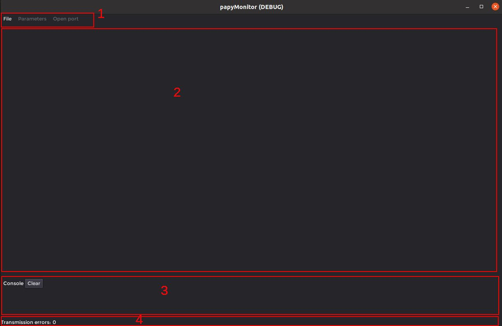

# The GUI application

The figure below shows the application when started.

1. Is the menu region: The File button permits to load the .lua configuration file. The Parameters button load/save/send to target the variables tagged with **Parameters** key. The Open port button open/close the serial port.
2. Is the user area that will contains the variables in user defined tabs and -if requested- the plotter and the 3D viewer.
3. Is the console that permits to display informations and errors as well as user messages from the target.
4. Is the status bar containing a counter for serial error transmission.

The figure below shows the application when a .lua configuration file is loaded. In this case, the user asked to have the plotter and the 3D viewer. You'll find this .lua file in the example02 of the examples folder in the **papyMonitor-microcontroller-generic** repository.

Once a valid .lua configuration file is loaded, the **Open port** button is no more greyed and -when clicked- the user can select the target related serial port among the ones that appears on the list.

Each variable has a small `M` next to it. This is a button that permits to enable/disable the monitoring for the variable.

There are four GroupTabs, the last one is a Commands tab, read the .lua file at the end to see how to do it.

The plotter has a button that permits to show the variables that are enabled for plotting. The user can select the color of each variable curve. The scope mode displays the variables as if it was displayed on a oscilloscope. The triggering button permits to trig to one variable, when enabled a black draggable horizontal line set the trigger level. When the pointer is over the plotter, one can interact with it with the mouse buttons and the mouse wheel (pressing ctrl + wheel change the Y division).

The 3D viewer shows the shapes defined/loaded by the .lua file. When the pointer is over the 3D view, one can interact with it with the mouse buttons and the mouse wheel.
